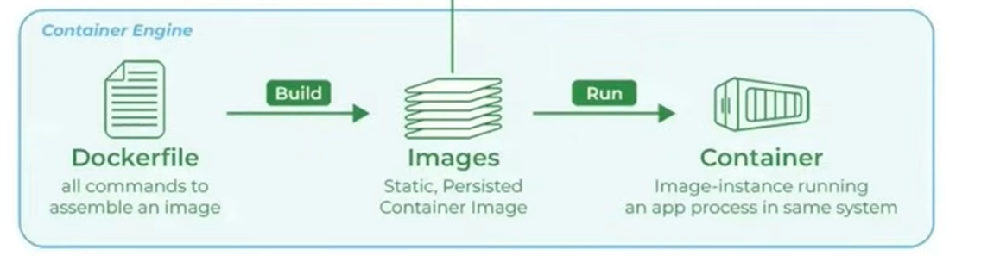

## Let's ace Docker !!!💀💀💀

## Docker:
- Its a platform designed  to help developers  build, share and run container applications.

### Why do we need Docker?
1. Consistency Across Environments:-
    🚀Problem: Applications often behave differently in development, testing and production environment dur to variations in configurations dependencies and infrastructure.
   💡Solution: Docker containers encapsulate all the necessary components , ensuring the application runs consistently across all environments.
2. Isolation:-
    🚀Problem:Running same application on the same host can lead to conflicts, such as dependency clashes or resource contention
   💡Solution:Docker provides isolated environments for each application , preventing interference and ensuring stable performance.
3. Scalability:-
    🚀Problem:Scaling applications to handle increased load can be challenging , requiring manual intervnetion and configuration.
   💡Solution:Docker makes it easy to scale applications horizontally by making multiple container instances allowing for quick and efficient scaling.

### Docker helps with:
  - Consistency across environments-->docker ensures that our app runs the same in my computer, ur computer ur boss's computer
    - reduces confusion and boosts collaboration making development and deployment efficient and faster
  - Isolation-->Docker maintains a clear boundary b/w our app and its dependencies
    - improves security , simplifies debugging and makes development smoother
  - Portability--> lets us easily move our applicstion among different stages like maintainence or testing etc
  - Lightweight-->makes more efficient-->faster appplication starttimes 
  - Version Control-->like a rewind for our app
  - Scalability--> Docker makes it easy to scale apps
    - It does it by making multiple copies of the same applicaation whenever number of consumers are more (c/d horixontal scaling)
    - like multiple copies of menu at each table...to serve multiple customers at the same time
  - Devops Integration-->bridges gap b/w development and operations


### Docker Engine:
    It is the core component of the Docker platform responsible for creating, running and managing Docker containers.It serves as the runtime that powers Docker's conatinerization capabilities.


### How does docker work?
2 concepts in Docker--> Images and Containers

#### Image-> lightweight, standalone executable package that includes everything to run a piece of software(code, libraries,runtimes , system tools etc)
    - for eg: its just like a recipe card--> we have ingredients, recipes and steps to make the dish

#### Containers--> Runnable instance for docker image--> Means we run/implement  the docker image in the containers...
    - It includes code, runtimes, system tools and libraries
    - eg: recipe is the image but making the cake/dish in actual is the docker container
    -🚀🚀 We can make multiple  containers from a single image 

#### To understand about docker volumes and networks: follow this ::  https://chatgpt.com/share/6ab1852d-ee3c-83e8-862a-db0dc39a569d

### Docker workflow:
3 parts:
1. Docker client or Docker CLI--> user interface to interact with docker--> cli or gui
2. Docker host aka docker daemon-->bg process responsible for managing containers on the host system
3. Docker registry aka docker hub--> centralised repo of docker images--> hosts both public and private registries or packages


### In simple words:
- Docker client is the command center
- Docker host executes these containers and manages containers
- Docker registry serves as a centralised storage for shaaring and distributing images--> service that stores and distributes Docker images

![Docker Desktop Working & Architecture ](img_4.png


### Let's have a brief dive into docker commands : 

````aiignore
A self-sufficient runtime for containers

Common Commands:
  run         Create and run a new container from an image
  exec        Execute a command in a running container
  ps          List containers
  build       Build an image from a Dockerfile
  bake        Build from a file
  pull        Download an image from a registry
  push        Upload an image to a registry
  images      List images
  login       Authenticate to a registry
  logout      Log out from a registry
  search      Search Docker Hub for images
  version     Show the Docker version information
  info        Display system-wide information

Management Commands:
  agent*      Docker AI Agent Runner
  ai*         Docker AI Agent - Ask Gordon
  builder     Manage builds
  buildx*     Docker Buildx
  compose*    Docker Compose
  container   Manage containers
  context     Manage contexts
  debug*      Get a shell into any image or container
  desktop*    Docker Desktop commands
  dhi*        CLI for managing Docker Hardened Images
  extension*  Manages Docker extensions
  image       Manage images
  init*       Creates Docker-related starter files for your project
  manifest    Manage Docker image manifests and manifest lists
  mcp*        Docker MCP Plugin
  model*      Docker Model Runner
  network     Manage networks
  offload*    Docker Offload
  pass*       Docker Pass Secrets Manager Plugin (beta)
  plugin      Manage plugins
  scout*      Docker Scout
  system      Manage Docker
  volume      Manage volumes

Swarm Commands:
  swarm       Manage Swarm

Commands:
  attach      Attach local standard input, output, and error streams to a running container
  commit      Create a new image from a container's changes
  cp          Copy files/folders between a container and the local filesystem
  create      Create a new container
  diff        Inspect changes to files or directories on a container's filesystem
  events      Get real time events from the server
  export      Export a container's filesystem as a tar archive
  history     Show the history of an image
  import      Import the contents from a tarball to create a filesystem image
  inspect     Return low-level information on Docker objects
  kill        Kill one or more running containers
  load        Load an image from a tar archive or STDIN
  logs        Fetch the logs of a container
  pause       Pause all processes within one or more containers
  port        List port mappings or a specific mapping for the container
  rename      Rename a container
  restart     Restart one or more containers
  rm          Remove one or more containers
  rmi         Remove one or more images
  save        Save one or more images to a tar archive (streamed to STDOUT by default)
  start       Start one or more stopped containers
  stats       Display a live stream of container(s) resource usage statistics
  stop        Stop one or more running containers
  tag         Create a tag TARGET_IMAGE that refers to SOURCE_IMAGE
  top         Display the running processes of a container
  unpause     Unpause all processes within one or more containers
  update      Update configuration of one or more containers
  wait        Block until one or more containers stop, then print their exit codes
      --tlscert string     Path to TLS certificate file (default
                           "C:\\Users\\KIIT\\.docker\\cert.pem")
      --tlskey string      Path to TLS key file (default
                           "C:\\Users\\KIIT\\.docker\\key.pem")
      --tlsverify          Use TLS and verify the remote
  -v, --version            Print version information and quit
````


### Let's learn how to create an image and put it in registry/hub:

- In short:This is the workflow



#### Steps:
1. Create a requirements.txt file
   2. Create a Dockerfile--> we will write instructions for creating the image: We mention the following details
      - Base image--> use 
       ````docker
      FROM <FRAMEWORK/LANGUA VERSION>
       ````
        
      - working directory
           ````docker  
            WORKDIR /app
        ````
      - copy command
        ````docker  
        COPY . /app
        ````
      - run command
        ````docker  
            RUN <give the command for installing all the requirements from requirements.txt>
        ````
      - port
        EXPOSE <port no>
      - command--> command by which the file gets executed
        ````docker  
        CMD ["<language/framework>","./app.<ext>"]
        ````