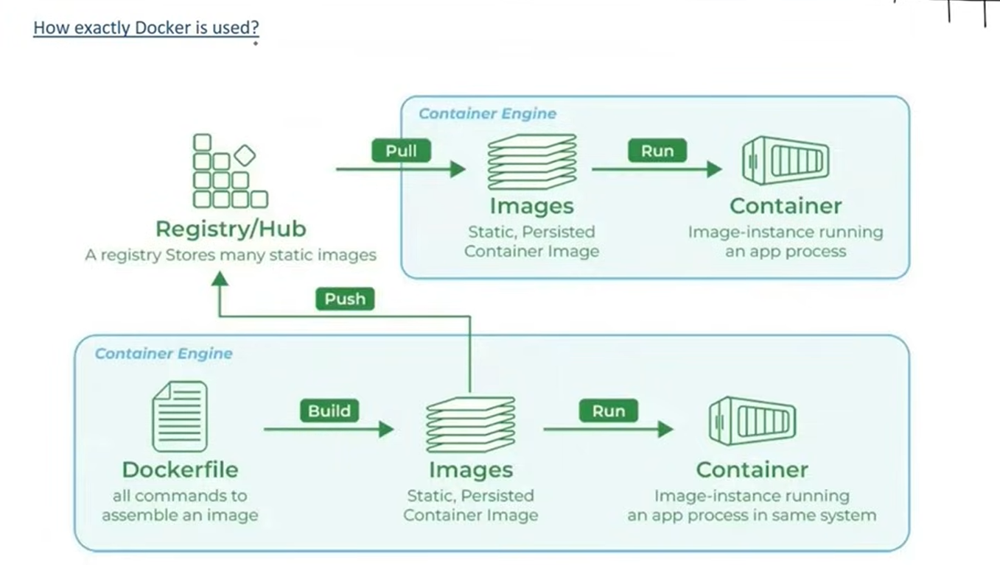
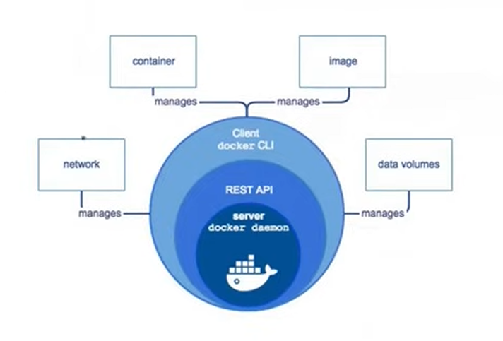
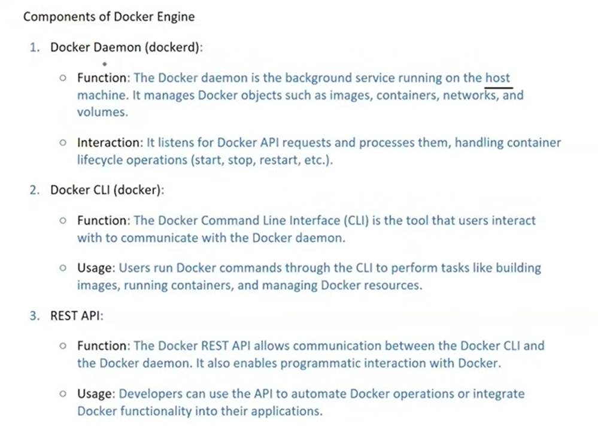
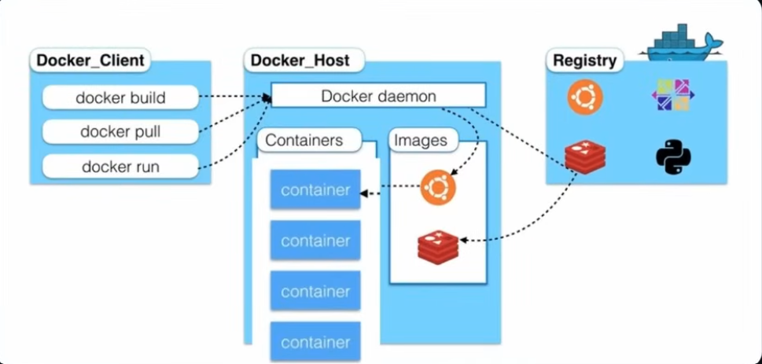

## Let's ace Docker !!!💀💀💀

## Docker:
- Its a platform designed  to help developers  build, share and run container applications.

### Why do we need Docker?
1. Consistency Across Environments:-
    🚀Problem: Applications often behave differently in development, testing and production environment dur to variations in configurations dependencies and infrastructure.
   💡Solution: Docker containers encapsulate all the necessary components , ensuring the application runs consistently across all environments.
2. Isolation:-
    🚀Problem:Running same application on the same host can lead to conflicts, such as dependency clashes or resource contention
   💡Solution:Docker provides isolated environments for each application , preventing interference and ensuring stable performance.
3. Scalability:-
    🚀Problem:Scaling applications to handle increased load can be challenging , requiring manual intervnetion and configuration.
   💡Solution:Docker makes it easy to scale applications horizontally by making multiple container instances allowing for quick and efficient scaling.

### Docker helps with:
  - Consistency across environments-->docker ensures that our app runs the same in my computer, ur computer ur boss's computer
    - reduces confusion and boosts collaboration making development and deployment efficient and faster
  - Isolation-->Docker maintains a clear boundary b/w our app and its dependencies
    - improves security , simplifies debugging and makes development smoother
  - Portability--> lets us easily move our applicstion among different stages like maintainence or testing etc
  - Lightweight-->makes more efficient-->faster appplication starttimes 
  - Version Control-->like a rewind for our app
  - Scalability--> Docker makes it easy to scale apps
    - It does it by making multiple copies of the same applicaation whenever number of consumers are more (c/d horixontal scaling)
    - like multiple copies of menu at each table...to serve multiple customers at the same time
  - Devops Integration-->bridges gap b/w development and operations

### Docker Engine:
    It is the core component of the Docker platform responsible for creating, running and managing Docker containers.It serves as the runtime that powers Docker's conatinerization capabilities.

### How does docker work?
2 concepts in Docker--> Images and Containers

#### Image-> lightweight, standalone executable package that includes everything to run a piece of software(code, libraries,runtimes , system tools etc)
    - for eg: its just like a recipe card--> we have ingredients, recipes and steps to make the dish

#### Containers--> Runnable instance for docker image--> Means we run/implement  the docker image in the containers...
    - It includes code, runtimes, system tools and libraries
    - eg: recipe is the image but making the cake/dish in actual is the docker container
    -🚀🚀 We can make multiple  containers from a single image 

#### To understand about docker volumes and networks: follow this ::  https://chatgpt.com/share/6ab1852d-ee3c-83e8-862a-db0dc39a569d

### Docker workflow:
3 parts:
1. Docker client or Docker CLI--> user interface to interact with docker--> cli or gui
2. Docker host aka docker daemon-->bg process responsible for managing containers on the host system
3. Docker registry aka docker hub--> centralised repo of docker images--> hosts both public and private registries or packages

### In simple words:
- Docker client is the command center
- Docker host executes these containers and manages containers
- Docker registry serves as a centralised storage for shaaring and distributing images 